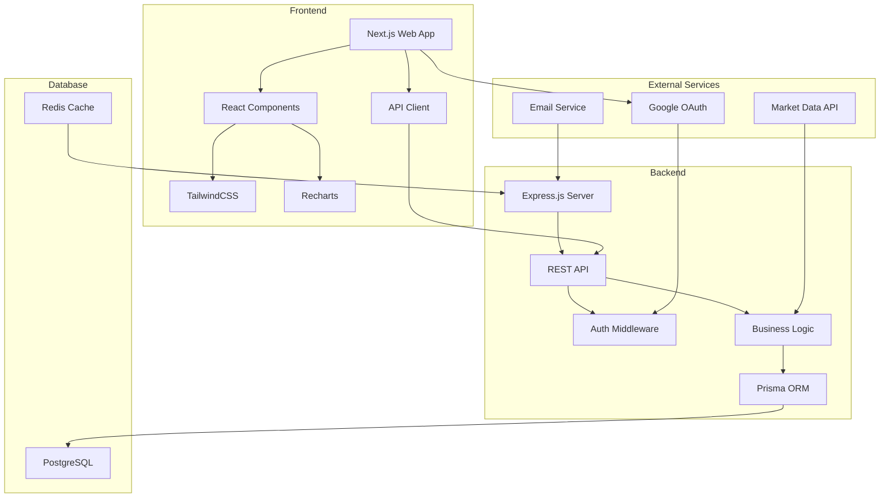

# 💰 WealthLog - Smart Personal Finance Management Platform

<div align="center">
  
  
  
  
  
  
</div>

<div align="center">
  <h3>🚀 Track • Analyze • Grow Your Wealth</h3>
  <p>A comprehensive financial management platform that helps you track investments, analyze spending patterns, and make informed financial decisions.</p>
</div>

---

## 📋 Table of Contents

- [Features](#-features)
- [Architecture](#-architecture)
- [Technology Stack](#-technology-stack)
- [Getting Started](#-getting-started)
- [Development](#-development)
- [Deployment](#-deployment)
- [Maintenance Script](#-maintenance-script)
- [API Documentation](#-api-documentation)
- [Contributing](#-contributing)
- [License](#-license)

## ✨ Features

### 📊 **Financial Dashboard**
- Real-time net worth tracking
- Asset allocation visualization
- Performance metrics and trends
- Interactive charts with Recharts

### 💼 **Portfolio Management**
- Multi-account support (Bank, Investment, Crypto, Real Estate)
- Transaction history and categorization
- Automated portfolio rebalancing suggestions
- Tax optimization strategies

### 📈 **Investment Tracking**
- Stock portfolio management
- Cryptocurrency tracking
- Real estate investments
- Dividend income tracking

### 💳 **Expense Management**
- Automatic transaction categorization
- Budget creation and monitoring
- Spending trends analysis
- Bill reminders and recurring expenses

### 🔐 **Security & Authentication**
- JWT-based authentication
- Google OAuth integration
- Two-factor authentication (coming soon)
- Role-based access control
- Secure session management

### 📱 **Cross-Platform**
- Responsive web application
- Mobile app (iOS/Android) with Capacitor
- Progressive Web App (PWA) support
- Offline functionality

## 🏗 Architecture



### Project Structure

```
wealthlogs/
├── 📁 wealthlogs-code/          # Main application code
│   ├── 📁 apps/                 # Applications
│   │   ├── 📱 backend/          # Express.js API server
│   │   │   ├── src/
│   │   │   │   ├── routes/      # API routes
│   │   │   │   ├── middleware/  # Express middleware
│   │   │   │   ├── services/    # Business logic
│   │   │   │   └── utils/       # Utility functions
│   │   │   └── prisma/          # Database schema
│   │   ├── 🌐 web/              # Next.js frontend
│   │   │   ├── pages/           # Next.js pages
│   │   │   ├── components/      # React components
│   │   │   ├── hooks/           # Custom React hooks
│   │   │   ├── contexts/        # React contexts
│   │   │   └── styles/          # CSS/Tailwind styles
│   │   └── 📱 mobile/           # Capacitor mobile app
│   └── 📦 packages/             # Shared packages
│       └── shared/              # Shared utilities
├── 📁 scripts/                  # Maintenance and utility scripts
│   ├── maintain.sh              # Main maintenance script
│   ├── config.env               # Configuration file
│   └── README.md               # Script documentation
├── 📁 docs/                     # Documentation
│   ├── guides/                  # Setup and usage guides
│   ├── api/                     # API documentation
│   └── architecture/            # System design docs
├── 📋 turbo.json                # Turborepo configuration
├── 📋 vercel.json               # Vercel deployment config
└── 📋 package.json              # Root package configuration
```

## 💻 Technology Stack

### Frontend
- **Framework:** Next.js 14 with App Router
- **UI Library:** React 18
- **Styling:** TailwindCSS 3.0
- **Charts:** Recharts
- **State Management:** React Context API
- **Forms:** React Hook Form
- **HTTP Client:** Axios
- **Type Safety:** TypeScript 5.0

### Backend
- **Runtime:** Node.js 18 LTS
- **Framework:** Express.js 4.18
- **ORM:** Prisma 5.0
- **Authentication:** JWT + Passport.js
- **Validation:** Express Validator
- **Logging:** Winston
- **Testing:** Jest + Supertest

### Database
- **Primary:** PostgreSQL 15
- **Caching:** Redis (optional)
- **Migrations:** Prisma Migrate

### DevOps
- **Monorepo:** Turborepo
- **Deployment:** Vercel (Frontend) + Render (Backend)
- **CI/CD:** GitHub Actions
- **Monitoring:** Sentry
- **Analytics:** Google Analytics

## 🚀 Getting Started

### Prerequisites

- Node.js 18+ and npm 9+
- PostgreSQL 14+
- Redis (optional, for caching)
- Git

### Quick Setup

1. **Clone the repository**
```bash
git clone https://github.com/yourusername/wealthlogs.git
cd wealthlogs
```

2. **Run the setup script**
```bash
chmod +x scripts/maintain.sh
./scripts/maintain.sh init
```

3. **Configure environment**
```bash
./scripts/maintain.sh config edit
# Update database credentials and other settings
```

4. **Setup database**
```bash
./scripts/maintain.sh db:setup
```

5. **Start development servers**
```bash
./scripts/maintain.sh dev
```

Your application will be available at:
- Frontend: http://localhost:3000
- Backend: http://localhost:5000

## 🔧 Development

### Start Individual Services

```bash
# Start backend only
./scripts/maintain.sh start backend

# Start frontend only
./scripts/maintain.sh start frontend

# Start all services
./scripts/maintain.sh start all
```

### Database Management

```bash
# Run migrations
./scripts/maintain.sh db:migrate

# Open Prisma Studio
./scripts/maintain.sh db:studio

# Reset database (caution!)
./scripts/maintain.sh db:reset
```

### Testing

```bash
# Run test suite
./scripts/maintain.sh test

# Test authentication
./scripts/maintain.sh auth:test
```

### Building

```bash
# Build for production
./scripts/maintain.sh build
```

## 🌐 Deployment

### Frontend (Vercel)

1. **Connect GitHub repository to Vercel**

2. **Set environment variables:**
```env
NEXT_PUBLIC_API_URL=https://your-backend.onrender.com
NEXT_PUBLIC_GOOGLE_CLIENT_ID=your-google-client-id
```

3. **Deploy:**
```bash
vercel --prod
```

### Backend (Render)

1. **Create a new Web Service on Render**

2. **Set environment variables:**
```env
NODE_ENV=production
DATABASE_URL=postgresql://...
JWT_ACCESS_SECRET=your-secret
JWT_REFRESH_SECRET=your-secret
FRONTEND_URL=https://your-frontend.vercel.app
```

3. **Deploy:**
```bash
git push origin main
```

### Pre-deployment Checklist

```bash
# Run deployment check
./scripts/maintain.sh deploy:check

# This validates:
# ✅ Environment configuration
# ✅ Test suite passes
# ✅ No exposed secrets
# ✅ Build success
# ✅ Git status clean
```

## 🛠 Maintenance Script

The project includes a comprehensive maintenance script for all common operations:

### Key Commands

| Command | Description |
|---------|-------------|
| `init` | Initialize/update project |
| `dev` | Start all development servers |
| `start [service]` | Start specific service |
| `test` | Run test suite |
| `build` | Build for production |
| `deploy:check` | Pre-deployment validation |
| `fix` | Auto-fix common issues |
| `doctor` | System diagnostics |
| `clean` | Clean build artifacts |

### Configuration

Edit `scripts/config.env` to customize:
- Database credentials
- Server ports
- Production URLs
- Feature flags

### Documentation

See [scripts/README.md](scripts/README.md) for complete documentation.

## 📚 API Documentation

### Authentication Endpoints

| Method | Endpoint | Description |
|--------|----------|-------------|
| POST | `/api/auth/register` | Register new user |
| POST | `/api/auth/login` | Login user |
| GET | `/api/auth/me` | Get current user |
| POST | `/api/auth/refresh` | Refresh token |
| POST | `/api/auth/logout` | Logout user |

### Dashboard Endpoints

| Method | Endpoint | Description |
|--------|----------|-------------|
| GET | `/api/dashboard/networth` | Get net worth data |
| GET | `/api/dashboard/networth/summary` | Get summary stats |
| GET | `/api/dashboard/accounts` | List all accounts |
| GET | `/api/dashboard/transactions` | Recent transactions |

### Account Management

| Method | Endpoint | Description |
|--------|----------|-------------|
| GET | `/api/account` | List accounts |
| POST | `/api/account` | Create account |
| PUT | `/api/account/:id` | Update account |
| DELETE | `/api/account/:id` | Delete account |

For complete API documentation, see [docs/api/](docs/api/).

## 🤝 Contributing

We welcome contributions! Please follow these steps:

1. Fork the repository
2. Create a feature branch (`git checkout -b feature/amazing-feature`)
3. Commit your changes (`git commit -m 'Add amazing feature'`)
4. Push to the branch (`git push origin feature/amazing-feature`)
5. Open a Pull Request

### Development Guidelines

- Follow TypeScript best practices
- Write tests for new features
- Update documentation
- Use conventional commits
- Run `./scripts/maintain.sh test` before committing

## 📄 License

This project is licensed under the MIT License - see the [LICENSE](LICENSE) file for details.

## 🙏 Acknowledgments

- Built with ❤️ by the WealthLog Team
- Special thanks to all contributors
- Powered by amazing open-source projects

## 📞 Support

- 📧 Email: support@wealthlogs.com
- 📖 Documentation: [docs/](docs/)
- 🐛 Issues: [GitHub Issues](https://github.com/yourusername/wealthlogs/issues)
- 💬 Discord: [Join our community](https://discord.gg/wealthlogs)

---

<div align="center">
  <p>Made with ❤️ for better financial management</p>
  <p>© 2024 WealthLog. All rights reserved.</p>
</div>
