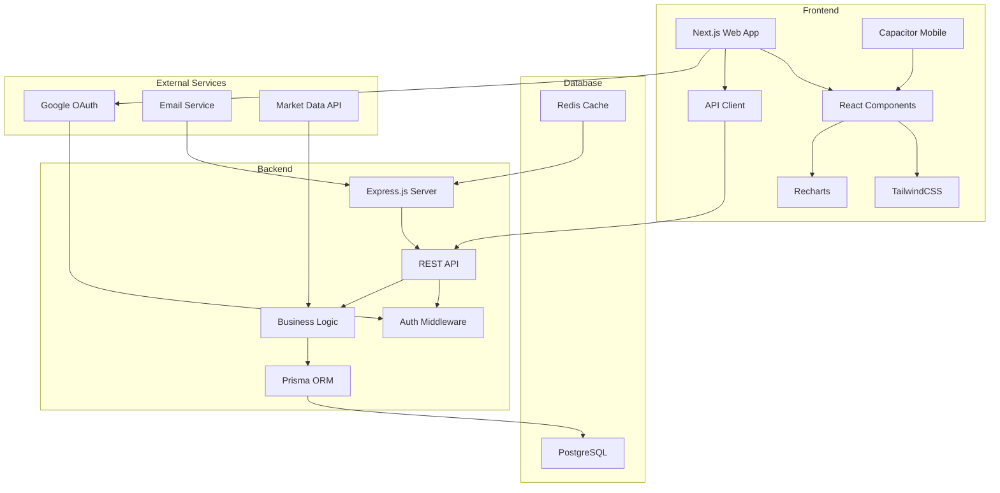

# 💰 WealthLog - Smart Personal Finance Management Platform

<div align="center">
  
  
  
  
  
  
</div>

<div align="center">
  <h3>🚀 Track • Analyze • Grow Your Wealth</h3>
  <p>A comprehensive financial management platform that helps you track investments, analyze spending patterns, and make informed financial decisions.</p>
</div>

---

## 📋 Table of Contents

- [Features](#-features)
- [Architecture](#-architecture)
- [Technology Stack](#-technology-stack)
- [Getting Started](#-getting-started)
- [Development Workflow](#-development-workflow)
- [Deployment](#-deployment)
- [Maintenance Script](#-maintenance-script)
- [API Documentation](#-api-documentation)
- [Contributing](#-contributing)
- [Documentation](#-documentation)
- [License](#-license)

## ✨ Features

### 📊 **Financial Dashboard**
- Real-time net worth tracking
- Asset allocation visualization
- Performance metrics and trends
- Interactive charts with Recharts

### 💼 **Portfolio Management**
- Multi-account support (Bank, Investment, Crypto, Real Estate)
- Transaction history and categorization
- Automated portfolio rebalancing suggestions
- Tax optimization strategies

### 📈 **Investment Tracking**
- Stock portfolio management
- Cryptocurrency tracking
- Real estate investments
- Dividend income tracking

### 💳 **Expense Management**
- Automatic transaction categorization
- Budget creation and monitoring
- Spending trends analysis
- Bill reminders and recurring expenses

### 🔐 **Security & Authentication**
- JWT-based authentication with access/refresh tokens
- Google OAuth integration
- Role-based access control (RBAC)
- Secure session management
- Email verification system

### 📱 **Cross-Platform**
- Responsive web application
- Mobile app (iOS/Android) with Capacitor
- Progressive Web App (PWA) support
- Offline functionality

## 🏗 Architecture



### Project Structure

```
wealthlogs/
├── 📁 wealthlogs-code/          # Main application code
│   ├── 📁 apps/                 # Applications
│   │   ├── 🔧 backend/          # Express.js API server
│   │   │   ├── src/
│   │   │   │   ├── routes/      # API routes
│   │   │   │   ├── middleware/  # Express middleware
│   │   │   │   ├── services/    # Business logic
│   │   │   │   └── utils/       # Utility functions
│   │   │   └── prisma/          # Database schema
│   │   ├── 🌐 web/              # Next.js frontend
│   │   │   ├── pages/           # Next.js pages
│   │   │   ├── components/      # React components
│   │   │   ├── hooks/           # Custom React hooks
│   │   │   ├── contexts/        # React contexts
│   │   │   └── styles/          # CSS/Tailwind styles
│   │   └── 📱 mobile/           # Capacitor mobile app
│   └── 📦 packages/             # Shared packages
│       └── shared/              # Shared utilities
├── 📁 scripts/                  # Maintenance and utility scripts
│   ├── maintain.sh              # Main maintenance script
│   ├── config.env               # Configuration file
│   └── README.md               # Script documentation
├── 📁 docs/                     # Documentation
│   ├── CLAUDE_REFERENCE.md     # Quick reference for Claude AI
│   ├── authentication-flow.md   # Auth system documentation
│   ├── auth-system.md          # Detailed auth documentation
│   └── deployment-env.md       # Deployment environment guide
└── README.md                    # This file
```

## 💻 Technology Stack

### Frontend
- **Framework:** Next.js 14 with Pages Router
- **UI Library:** React 18
- **Styling:** TailwindCSS 3.0
- **Charts:** Recharts
- **State Management:** React Context API
- **Forms:** React Hook Form
- **HTTP Client:** Axios
- **Type Safety:** TypeScript 5.0
- **Mobile:** Capacitor

### Backend
- **Runtime:** Node.js 18 LTS
- **Framework:** Express.js 4.18
- **ORM:** Prisma 5.0
- **Authentication:** JWT + Passport.js
- **Validation:** Express Validator
- **Logging:** Winston
- **Testing:** Jest + Supertest

### Database
- **Primary:** PostgreSQL 15
- **Caching:** Redis (optional)
- **Migrations:** Prisma Migrate

### DevOps
- **Monorepo:** Turborepo
- **Frontend Deployment:** Vercel (auto-deploy on push)
- **Backend Deployment:** Render (auto-deploy on push)
- **CI/CD:** GitHub Actions
- **Monitoring:** Built-in logging system
- **Scripts:** Custom maintenance script

## 🚀 Getting Started

### Prerequisites

- Node.js 18+ and npm 9+
- PostgreSQL 14+
- Git
- Redis (optional, for caching)

### 1. Clone the Repository

```bash
git clone https://github.com/yourusername/wealthlogs.git
cd wealthlogs
```

### 2. Create PostgreSQL Database

```sql
# Connect to PostgreSQL as superuser
psql -U postgres

# Create database and user
CREATE USER abechay WITH PASSWORD '12345678';
CREATE DATABASE wealthlog OWNER abechay;
GRANT ALL PRIVILEGES ON DATABASE wealthlog TO abechay;
\q
```

> **Note:** Replace `abechay` and `12345678` with your preferred username and password. You'll update these in the configuration file in the next steps.

### 3. Configure Database Settings

```bash
# Copy the example configuration
cp scripts/config.env.example scripts/config.env

# Edit the configuration file with your database credentials
# Update DB_USERNAME and DB_PASSWORD to match what you created above
nano scripts/config.env  # or use your preferred editor
```

### 4. Initialize the Project

```bash
# Make the maintenance script executable (Unix/Mac/Linux)
chmod +x scripts/maintain.sh

# On Windows, use Git Bash or WSL to run:
./scripts/maintain.sh init

# This will:
# - Install all dependencies (root, backend, frontend, shared)
# - Create environment files from config
# - Build shared packages
# - Generate Prisma client
```

### 5. Setup Database Schema

```bash
# Create database tables and run migrations
./scripts/maintain.sh db:setup
```

### 6. Start Development Servers

```bash
# Start all services (frontend + backend)
./scripts/maintain.sh dev

# Or start individually:
./scripts/maintain.sh start backend   # Backend only (port 5000)
./scripts/maintain.sh start frontend  # Frontend only (port 3000)
```

Your application will be available at:
- **Frontend:** http://localhost:3000
- **Backend API:** http://localhost:5000
- **Database GUI:** Run `./scripts/maintain.sh db:studio` (port 5555)

### 7. Test Login

Use these test credentials:
- **Username:** bech
- **Password:** 123

## 🔄 Development Workflow

### Branching Strategy

We use a Git Flow inspired branching strategy:

```
master (production)
  └── staging (pre-production testing)
       └── feature/your-feature-name (development)
```

### Development Process

1. **Create a feature branch from staging:**
```bash
git checkout staging
git pull origin staging
git checkout -b feature/your-feature-name
```

2. **Make your changes and test locally:**
```bash
# Run tests
./scripts/maintain.sh test

# Check for issues
./scripts/maintain.sh doctor
```

3. **Commit your changes:**
```bash
git add .
git commit -m "feat: description of your feature"
```

4. **Push and create Pull Request:**
```bash
git push origin feature/your-feature-name
# Open PR to staging branch on GitHub
```

5. **After PR is merged to staging:**
   - Test on staging environment
   - If everything works, create PR from staging to master

6. **Deployment happens automatically:**
   - Vercel deploys frontend on push to master
   - Render deploys backend on push to master

### Commit Message Convention

Use conventional commits:
- `feat:` New feature
- `fix:` Bug fix
- `docs:` Documentation changes
- `style:` Code style changes
- `refactor:` Code refactoring
- `test:` Test changes
- `chore:` Maintenance tasks

## 🌐 Deployment

### Pre-deployment Checklist

Always run before deploying:
```bash
./scripts/maintain.sh deploy:check
```

This validates:
- ✅ Environment configuration
- ✅ Test suite passes
- ✅ No exposed secrets
- ✅ Build success
- ✅ Git status clean

### Frontend Deployment (Vercel)

1. **The project GitHub repository is connected to Vercel**

2. **Environment variables are set in Vercel dashboard:**
```env
NEXT_PUBLIC_API_URL=https://wealthlog-backend-hx43.onrender.com
NEXT_PUBLIC_GOOGLE_CLIENT_ID=your-google-client-id
```

3. **Automatic deployment on push to master (wealthlogs.com) or staging (bechays.com) branches**

### Backend Deployment (Render)

1. **Web Service on Render as connected to GitHub repo**

2. **Environment variables are set in Render dashboard:**
```env
NODE_ENV=production
DATABASE_URL=postgresql://...
JWT_ACCESS_SECRET=your-secret
JWT_REFRESH_SECRET=your-secret
SECRET_KEY=your-secret
SESSION_SECRET=your-secret
FRONTEND_URL=https://wealthlogs.com
ALLOWED_ORIGINS=https://wealthlogs.com,https://www.wealthlogs.com
```

3. **Deployment is automatic on push to master branch**

### Post-deployment Verification

```bash
# Check production status (wait 2 minutes after deployment)
./scripts/maintain.sh deploy:status

# Test production authentication
./scripts/maintain.sh auth:test prod
```

## 🛠 Maintenance Script

The project includes a comprehensive maintenance script (`scripts/maintain.sh`) for all common operations.

### Key Commands

| Command | Description |
|---------|-------------|
| **Setup & Config** |
| `init` | Initialize/update project |
| `config edit` | Edit configuration |
| `config validate` | Validate configuration |
| **Development** |
| `dev` | Start all development servers |
| `start [service]` | Start specific service |
| `test` | Run test suite |
| `fix` | Auto-fix common issues |
| **Database** |
| `db:setup` | Create database with migrations |
| `db:migrate` | Run pending migrations |
| `db:studio` | Open Prisma Studio GUI |
| `db:reset` | Reset database (⚠️ deletes data) |
| **Mobile App** |
| `mobile build [platform]` | Build mobile app |
| `mobile run [platform]` | Run on device/emulator |
| `mobile sync` | Sync Capacitor |
| **Deployment** |
| `deploy:check` | Pre-deployment validation |
| `deploy:status` | Check production status |
| `build` | Build for production |
| **Maintenance** |
| `doctor` | Run system diagnostics |
| `status` | Quick health check |
| `logs` | View logs |
| `clean` | Clean build artifacts |

For complete documentation, run:
```bash
./scripts/maintain.sh help
```

Or see [scripts/README.md](scripts/README.md)

## 📚 API Documentation

### Authentication Endpoints

| Method | Endpoint | Description |
|--------|----------|-------------|
| POST | `/api/auth/register` | Register new user |
| POST | `/api/auth/login` | Login user |
| GET | `/api/auth/me` | Get current user |
| POST | `/api/auth/refresh` | Refresh token |
| POST | `/api/auth/logout` | Logout user |
| GET | `/api/auth/verify-email` | Verify email |
| POST | `/api/auth/forgot-password` | Request password reset |
| POST | `/api/auth/reset-password` | Reset password |

### Dashboard Endpoints

| Method | Endpoint | Description |
|--------|----------|-------------|
| GET | `/api/dashboard/networth` | Get net worth data |
| GET | `/api/dashboard/networth/summary` | Get summary stats |
| GET | `/api/dashboard/accounts` | List all accounts |
| GET | `/api/dashboard/transactions` | Recent transactions |

### Account Management

| Method | Endpoint | Description |
|--------|----------|-------------|
| GET | `/api/account` | List accounts |
| POST | `/api/account` | Create account |
| PUT | `/api/account/:id` | Update account |
| DELETE | `/api/account/:id` | Delete account |

For complete API documentation, see [docs/api/](docs/api/)

## 🤝 Contributing

We welcome contributions! Please follow our development workflow:

1. **Fork the repository**
2. **Create a feature branch from staging**
3. **Make your changes with proper testing**
4. **Follow our commit message convention**
5. **Create a Pull Request to staging branch**
6. **Ensure all checks pass**

### Development Guidelines

- ✅ Write tests for new features
- ✅ Update documentation
- ✅ Follow TypeScript best practices
- ✅ Use the maintenance script for testing
- ✅ Ensure mobile compatibility
- ✅ Keep security in mind

## 📖 Documentation

Detailed documentation is available in the `docs/` directory:

- **[Quick Reference](docs/CLAUDE_REFERENCE.md)** - Quick reference guide
- **[Authentication System](docs/auth-system.md)** - Complete auth documentation
- **[Authentication Flow](docs/authentication-flow.md)** - Auth flow details
- **[Deployment Guide](docs/deployment-env.md)** - Environment setup
- **[Maintenance Script](scripts/README.md)** - Script documentation

## 🔒 Security

- JWT tokens with 15-minute access tokens and 7-day refresh tokens
- Automatic token rotation
- Password hashing with bcrypt
- Rate limiting on sensitive endpoints
- CORS configuration
- SQL injection prevention via Prisma
- XSS protection
- HTTPS only in production

## 📄 License

This project is licensed under the MIT License - see the [LICENSE](LICENSE) file for details.

## 🙏 Acknowledgments

- Built with ❤️ by the WealthLog Team
- Special thanks to all contributors
- Powered by amazing open-source projects

## 📞 Support

- 📧 Email: anthonybechay1@gmail.com
- 📖 Documentation: [docs/](docs/)
- 🐛 Issues: [GitHub Issues](https://github.com/yourusername/wealthlogs/issues)
- 💬 Discord: [Join our community](https://discord.gg/wealthlogs)

---

<div align="center">
  <p>Made with ❤️ for better financial management</p>
  <p>© 2025 WealthLogs. All rights reserved.</p>
</div>
